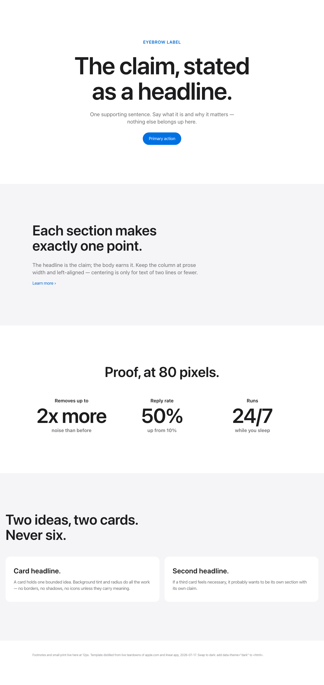
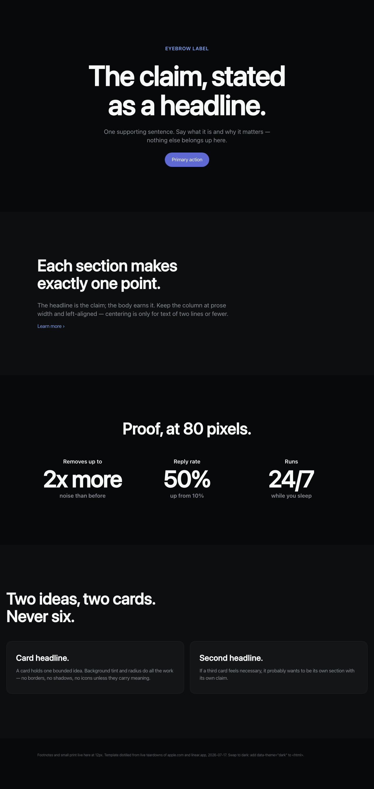

# html-design

An [agent skill](https://agentskills.io) that makes AI-generated HTML pages look like they were designed on purpose.

Instead of letting a model improvise CSS (the purple-gradient-hero look), this skill loads a design system **distilled from live computed-style teardowns** of two masterpieces:

- **apple.com/airpods-pro** → the light theme: type scale (96/56/28/17px, weight 600), the tracking rule (−1.5% at display sizes, positive at small sizes), 160px section rhythm, alternating `#f5f5f7` backgrounds, 80px stat heroes, pill buttons, one accent color
- **linear.app** → the dark theme: `#08090a` near-black, Inter at weight 510, tracking ≈ −2.2% of font-size, muted single accent

| Apple-light (default) | Linear-dark (`data-theme="dark"`) |
|---|---|
|  |  |

## What's inside

```
SKILL.md        # the doctrine: token tables + ten rules + common mistakes
template.html   # working starter page — hero, claim sections, stat heroes,
                # cards, scroll-reveal (reduced-motion & print/headless safe)
```

## Use it

**With Claude Code / any agent supporting skills:** drop the folder into your skills directory (e.g. `~/.claude/skills/html-design/`). It triggers whenever the agent builds an HTML page, deck, artifact, or report.

**By hand:** copy `template.html`, replace the content, keep the system. Flip to dark by adding `data-theme="dark"` to `<html>`.

## The one-sentence philosophy

> The design IS the type scale and the whitespace. Color, decoration, and motion are condiments.

## License

MIT
